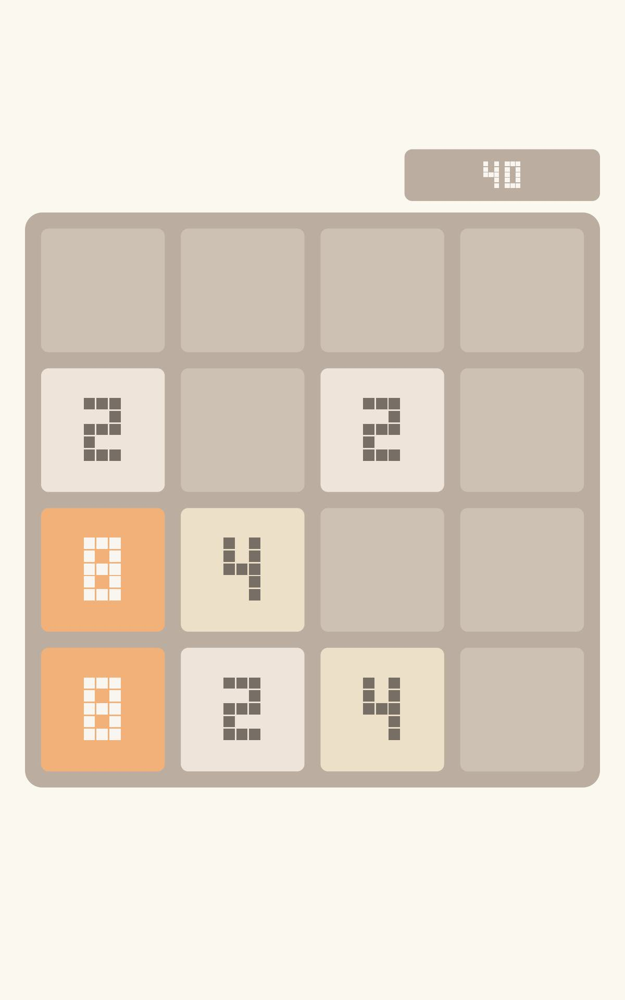

# Westlake DAYU600 — ART runtime + hwui bringup

**目标**:在 DAYU600 开发板(arm64 / OpenHarmony 6.1)上,用 Wine 式的 ART 适配层运行安卓 APK —— 拦截安卓系统 API,翻译到 OHOS 原生。不是容器/子系统(不跑 system_server、不跑第二个 OS),而是让 app 字节码直接在我们移植的 ART 上跑,只 shim 那条窄边界(系统服务 Binder + 渲染/输入 native)到 OHOS。

**当前里程碑(2026-07):真 APK 的 Activity 在标准 OHOS ART 上完整构造成功 + 2048 游戏渲染到开发板面板(截图为证)。**



*(上图:DAYU600 面板真机截图,2048 棋盘由我们移植的 libhwui.so 在 Mali-G57 上渲染)*

---

## 这一场的突破(2026-07-05)

### 1. 运行时 clone/vtable bug 根治(几个月的核心阻塞)
`AssignVTableIndexes`(class_linker.cc)用一个 alloca 上的 `BitVector initialized_methods` 追踪方法覆盖,但**缓冲没清零**——读未初始化内存是 UB,`-O2` 把 `std::fill_n` / `ClearAllBits` 都优化掉了,导致 `MethodHandles$Lookup` 的 vtable 被截断(37→11),`findVarHandle` 误派发到 `unreflectVarHandle`,`AtomicInteger.<clinit>` 抛 `CloneNotSupportedException`,连锁卡死 System/VMRuntime 初始化。

**修复**:在构造 BitVector 前用 **volatile 指针**逐字清零缓冲(volatile 写有可观察副作用,优化器不能删)。见 `class_linker.cc` 里 `[DAYU600-VTABLE-FIX v3]`。dex2oat 建镜像 clone=0 / Lookup vtable_len=37,反复验证稳定。

### 2. libart.so 加载失败根因(折磨整段的"运行时谜题"真相)
修复后运行时仍 clone=2、探针不触发。真相:**自建的 `libwestlake_art.so` 因缺 4 个符号根本 `dlopen` 不了(RTLD_NOW),app 一直退回加载旧的带 bug 库**。诊断法:`llvm-nm -D -u 我的库` vs 旧库 diff,补齐:
1. `create_disassembler` —— disassembler 未编入,加返回 null 的桩(`stubs/disassembler_stub.cc`)
2. `android::base::SendFileDescriptorVector` —— `abi_compatibility.cpp` 引入,加入 `ABASE_EXCLUDE`
3. `artCriticalNativeOutArgsSize` —— `link-libart` 漏了 `thread_cpu_stub.o`,补进链接行
4. `x86_cpu_enable_simd` —— 静态 libz.a 泄漏的 x86 SIMD 符号,加 no-op 桩

补齐后:`dlopen ok` / `JNI_CreateJavaVM rc=0` / **clone=0** / stage 跑 9456 行。

### 3. 核心 native 补全 → 真 Activity 完整构造(exit 0)
`Math.pow` / `System.currentTimeMillis` 等 ART intrinsic 在标准模式未注册,抛 `UnsatisfiedLinkError`。在 `InterpreterJni`(interpreter.cc)顶部加内联拦截(`std::pow` / `clock_gettime` 等)。解锁 `ColorSpace` clinit。

切到 `onCreateManual` 阶段跑真 `com.digiplex.game`:退出码 **0** —— MainActivity 创建、`setContentView` **inflate 出完整 view 层级**、16 个游戏按钮 + 棋盘 view 全部找到装配、触摸监听接上、游戏模型创建。**一个真实安卓游戏的 Activity 在标准 OHOS ART 上从进程启动到布局 inflate 全程跑通。**

### 4. 2048 游戏上屏(hwui 端,gate 1-3)
`ports/dayu600/gfx-smoke/hwui_2048.cpp` —— 用我们移植的 libhwui.so 完整渲染的可玩 2048(RenderProxy→RenderThread→CanvasContext→Skia GL→EGL→面板)。截图验证:1200×1920 面板上显示经典 2048 棋盘,跑在 Mali-G57。

---

## 现在的架构状态:两半各自跑通,尚未接通

- **ART 引擎**:能跑真 APK 字节码(clone/vtable 已修,真 Activity 构造到 exit 0)—— 但画面还没上屏
- **图形栈**:libhwui→OHOS 面板已通(2048 上屏证明)—— 但上屏的是原生 hwui_2048,不是真 app 的 View

**下一里程碑(真正的 gate-3)**:把真 app 在内存里 inflate 好的 DecorView 接到 hwui 渲染 —— app 进程内 JNI 桥:Java 把 DecorView 录进 `android.graphics.RenderNode` → 原生 `RenderProxy` + OHOS 窗口渲染上屏。之后是通用 `ActivityThread`(任意 app 同一条路起来,不用手写)+ PackageManager(装任意 APK)。

**北极星**:原神(Unity/IL2CPP native + Vulkan 自绘 Surface + 反作弊)—— 移动端最难靶子,需要通用启动 + 原生游戏 Surface 支持,是长期目标。

---

## 关键文件 + 复现

ART 源改动备份在 `src/`(真源在 `/Users/yao/westlake-local-build/`,**非 git,此处为唯一备份**):
- `src/art-latest/patches/runtime/class_linker.cc` —— vtable volatile 修复
- `src/art-latest/patches/runtime/interpreter/interpreter.cc` —— InterpreterJni + Math/System native 拦截
- `src/art-latest/Makefile.ohos-arm64` —— `link-libart` target(补齐 4 符号)
- `src/art-latest/stubs/{disassembler_stub.cc,westlake_exports.map}`

hwui 端:`ports/dayu600/gfx-smoke/{hwui_2048.cpp,build-hwui-2048.sh}`

**2048 上屏复现**(设备):
```bash
cd /data/local/tmp && LD_LIBRARY_PATH=/data/local/tmp:/system/lib64:/system/lib64/platformsdk:/system/lib64/chipset-sdk-sp ./hwui_2048 3600
# 截图(运行中):snapshot_display -f /data/local/tmp/x.jpeg
```

**libart.so 构建**(Mac):
```bash
cd /Users/yao/westlake-local-build/art-latest && make -f Makefile.ohos-arm64 -j8 link-libart
# 部署到 app 加载的确切路径($WESTLAKE_ROOT/art/libwestlake_art.so):
#   /data/local/tmp/westlake-dayu600{,-substrate}/art/libwestlake_art.so + substrate/android/lib64/libart.so
# 换库后必须重启 appspawn-x proto(deploy 脚本 line-15 会杀+起 fresh proto)
```
